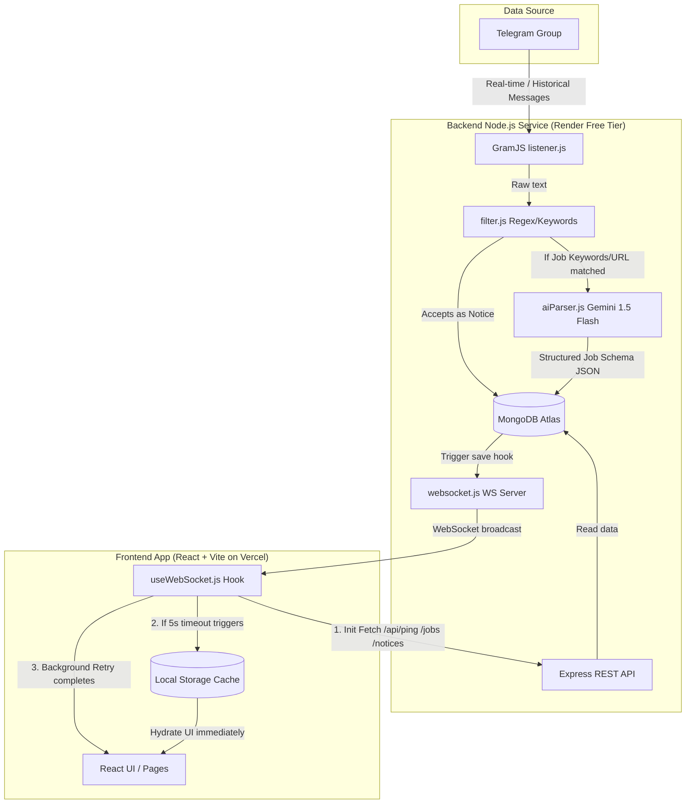

# Developer Documentation: Placement Alert Engine

This document provides a deep, technical dive into the architecture, design choices, and implementation details of the **Placement Alert Engine** from a developer's perspective. It details how the system operates under tight constraints, coordinates real-time data flows, and uses generative AI to structure unstructured communications.

---

## 🏗️ System Architecture & Data Flow

The Placement Alert Engine is an event-driven, real-time message processing system built on a full-stack Javascript environment (React + Node.js). 



### 1. Ingestion Phase
* **Source Connection**: A background client using **GramJS** (MTProto API) connects to Telegram using a persistent `StringSession` loaded from the environment variables.
* **Dual Ingestion Paths**:
  * **Hydration (On Startup)**: The system fetches the last 50 messages from the group, populating the database so that the application has immediate historical context.
  * **Real-time**: An active event handler listens for `NewMessage` events inside the target Telegram Group ID.

### 2. Message Routing & Filtering
A raw Telegram message is routed based on content analysis defined in `backend/utils/filter.js`:
* **Rejection Check**: If the message contains reject keywords (e.g. `selected`, `shortlisted`, `congrats`), it is discarded to prevent cluttering the job stream with selection announcements.
* **Notices Stream**: *Every* valid message that passes the basic sanity checks is saved as a **Notice** document in MongoDB (`type: 'notice'`). The system keeps only the last 7 notices to conserve storage and maintain relevance.
* **Jobs Stream**: If the message contains a URL *or* matches job keywords (e.g., `apply`, `portal`, `deadline`), it is qualified as a **Job** (`type: 'job'`) and passed to the AI Parsing phase.

### 3. AI Structuring (Gemini 1.5 Flash)
* **SDK**: Utilizes the modern `@google/genai` client SDK (`GoogleGenAI`).
* **Model**: Uses `gemini-1.5-flash` due to its high speed, high rate limit ceilings, and low latency.
* **Strict Schema Compliance**: The request enforces `responseMimeType: 'application/json'` along with a defined JSON schema defining the properties:
  * `companyName` (String, required)
  * `jobRole` (String, nullable)
  * `deadline` (String, nullable)
  * `applyLink` (String, nullable)
  * `eligibility` (String, nullable)
* **Fallback Strategy**: If the API key is missing or the Gemini API fails, the backend falls back gracefully to a basic regular expression parser.

### 4. Database Layer (MongoDB)
* Persistent storage uses MongoDB Atlas.
* Document structures are governed by the `Job` Mongoose schema, supporting pre-save hooks, virtual fields, and optimized compound/TTL indexing.

### 5. WebSocket Broadcasting & Client Updates
* A WebSocket server (built with `ws`) sits on top of the Express HTTP server.
* Once a message is processed and saved in the database, the server broadcasts a structured JSON event (`new_job` or `new_notice`) to all connected WebSocket clients.

---

## 💾 Database Schema & Optimization

The Mongoose model ([Job.js](file:///c:/Users/HP/Placment_reminder/backend/models/Job.js)) manages both job items and notices through a unified schema.

```javascript
const jobSchema = new mongoose.Schema({
  type: { type: String, enum: ['job', 'notice'], default: 'job', index: true },
  title: { type: String, required: true, trim: true },
  message: { type: String, required: true },
  link: { type: String, default: null },
  companyName: { type: String, default: null },
  jobRole: { type: String, default: null },
  deadline: { type: String, default: null },
  applyLink: { type: String, default: null },
  eligibility: { type: String, default: null },
  isAIParsed: { type: Boolean, default: false },
  telegramMessageId: { type: Number, required: true },
  groupId: { type: Number, required: true },
  createdAt: { type: Date, default: Date.now, index: true },
  expiresAt: { type: Date, default: null }
});
```

### Strategic Index Design
1. **Deduplication Index**: 
   ```javascript
   jobSchema.index({ telegramMessageId: 1, groupId: 1 }, { unique: true });
   ```
   Ensures that even if the Telegram listener restarts, duplicate ingestion events are caught at the database level and rejected with code `11000`.
2. **Auto-Expiry (TTL) Index**:
   ```javascript
   jobSchema.index(
     { expiresAt: 1 },
     {
       expireAfterSeconds: 0,
       partialFilterExpression: { type: 'job', expiresAt: { $ne: null } }
     }
   );
   ```
   Keeps database storage lightweight by automatically deleting job postings 24 hours after creation. The `partialFilterExpression` ensures that general announcements (`type: 'notice'`) remain persistent and do not expire.
3. **Pre-Save Lifecycle Hook**:
   ```javascript
   jobSchema.pre('save', function (next) {
     if (this.type === 'job' && !this.expiresAt) {
       this.expiresAt = new Date(Date.now() + 24 * 60 * 60 * 1000); // 24 Hours
     }
     next();
   });
   ```

---

## 🛡️ Backend Resiliency & Performance

To prevent crashes and resource leaks, the backend implements the following systems:

### 1. Database Connection Pooling
```javascript
await mongoose.connect(process.env.MONGODB_URI, {
    maxPoolSize: 10,                 // Up to 10 active connections to handle client spikes
    minPoolSize: 2,                  // Holds 2 warm connections at all times
    serverSelectionTimeoutMS: 5000,  // Fast fail to prevent thread blocking on db downtime
    socketTimeoutMS: 45000           // Closes idle sockets after 45 seconds
});
```

### 2. Gemini API Rate-Limiting Protection (Hydration Delay)
The Gemini API free-tier has a 15 Requests-Per-Minute (RPM) ceiling. If the hydration phase tries to process multiple jobs at startup, it will run out of API slots.
* **Deduplication Check**: Before querying Gemini, the listener checks MongoDB to see if that Telegram message ID has already been parsed.
* **Controlled Sleep Delay**: A `1500ms` promise delay blocks the hydration loop after each Gemini invocation to respect the rate limit window.
* **Ingestion Guard**: Hydration caps AI calls to 3 messages. Any remaining job messages fall back to basic Regex parsing.

### 3. Graceful Shutdown & Signal Handlers
Listen to OS signals (`SIGINT`, `SIGTERM`) to clean up open file descriptors and server processes:
* Shuts down the Telegram client gracefully.
* Closes all active Mongoose socket connections.
* Closes the Express HTTP server, letting current requests complete before termination.

---

## ⚡ Frontend Resilience & Perceived UX Optimization

Because the backend is hosted on a free cloud container (Render), the server enters a "sleep state" after 15 minutes of inactivity. The first visitor triggers a "cold start," which takes 30-60 seconds. To provide a seamless user experience, the frontend includes a series of robust optimizations:

```
[User Loads React App]
        │
        ├─► [Pre-Warming Ping] ──► Hits /api/ping (kicks off server wake-up)
        │
        ├─► [Primary Fetch] ──► Initiates /jobs and /notices
        │         │
        │         ├──► (Within 5s) ──▶ [Server awake] ──► Display Fresh Data
        │         │
        │         └──► (Tears down at 5s) ──▶ [Server sleeping]
        │                                  │
        │                                  ├─► Read & Render from LocalStorage Cache
        │                                  │
        │                                  └─► Fire [Background Retry] (un-timeouted)
        │                                            │
        │                                            └─► (Wakes up at 35s) ──► Re-render fresh data
        │
        └─► [WS Connection] ──► Attempts to connect (retries with Exponential Backoff)
```

### 1. Pre-Warming Ping
A non-blocking HTTP fetch triggers a request to `/api/ping` the moment the React index file is mounted. This initiates the Render server wake-up sequence immediately, before any complex UI data query compiles.

### 2. Cap-and-Fallback (useWebSocket.js)
The data loading sequence enforces a 5-second deadline via an `AbortController`:
```javascript
const controller = new AbortController();
const timeoutId = setTimeout(() => controller.abort(), 5000);

try {
    const [jobsRes, noticesRes] = await Promise.all([
        fetch(`${API_URL}/jobs`, { signal: controller.signal }),
        fetch(`${API_URL}/notices`, { signal: controller.signal })
    ]);
    // Save to localStorage cache if successful
} catch (error) {
    // If request aborts, read from localStorage
    const cachedJobs = localStorage.getItem('cachedJobs');
    if (cachedJobs) setJobs(JSON.parse(cachedJobs));
    
    // Begin silent background poll
    backgroundRetry();
}
```

### 3. Asynchronous Background Retry
While the user interacts with cached data, `backgroundRetry()` fires a silent, persistent fetch. Once the container completes its wake-up cycle (around 30-40 seconds), the promise resolves, local storage updates, and new cards populate the screen.

### 4. Shimmer Skeleton Grid
During the initial 5-second wait before the fallback cache loads, the UI renders animated SVG layout skeletons. This informs the user that the layout is active and loading content.

---

## 🎨 UI & Component Library

The frontend is styled using pure **Vanilla CSS** (`index.css`), providing high control, micro-animations, and responsiveness.

### Key Components

#### 1. [App.jsx](file:///c:/Users/HP/Placment_reminder/frontend/src/App.jsx)
Orchestrates the global state, pages navigation, and intercepts connectivity flags. If the client is disconnected and local cache is empty, it mounts `<ServerLoading />` which runs the shimmer skeleton loaders alongside a backend-wake alert banner.

#### 2. [JobCard.jsx](file:///c:/Users/HP/Placment_reminder/frontend/src/components/JobCard.jsx)
Presents structured placement drives. Key features:
* **Company Brand Avatar**: Generates a stable HSL background color based on a hash of the company name:
  ```javascript
  const getCompanyColor = (name) => {
      let hash = 0;
      for (let i = 0; i < name.length; i++) {
          hash = name.charCodeAt(i) + ((hash << 5) - hash);
      }
      const h = Math.abs(hash % 360);
      return `hsl(${h}, 60%, 40%)`;
  };
  ```
* **Real-time Expiry Countdown**: A React timer calculates the time remaining before the TTL index removes the job from the DB.
* **Badge Pills**: Explicit visual highlights for AI-extracted details like `eligibility` and `deadline`.
* **Details Accordion**: Collapsible element to toggle visibility of the raw Telegram message text.

#### 3. [NoticeCard.jsx](file:///c:/Users/HP/Placment_reminder/frontend/src/components/NoticeCard.jsx)
A chat-bubble styled notice container. It formats absolute dates into relative strings (e.g., `"10m ago"`) and shows a prominent "New" badge for posts received in the last 5 minutes.

#### 4. [Sidebar.jsx](file:///c:/Users/HP/Placment_reminder/frontend/src/components/Sidebar.jsx)
The main navigation frame. It displays the counts of active items and renders a footer connection indicator reflecting the WebSocket status (`Live` in green, `Connecting...` in yellow, `Reconnecting...` in red).

---

## 🚀 Environment Configuration

### Backend Environment Variables
| Key | Type | Description |
| :--- | :--- | :--- |
| `API_ID` | Number | Telegram App ID from my.telegram.org |
| `API_HASH` | String | Telegram API hash |
| `SESSION_STRING` | String | Encoded string representing the active GramJS session |
| `TELEGRAM_GROUP_ID` | Number | Group ID to read messages from (usually starts with `-100`) |
| `MONGODB_URI` | String | MongoDB Atlas connection string |
| `GEMINI_API_KEY` | String | Gemini API key for structured job parsing |
| `PORT` | Number | Port the server listens on (defaults to `3000`) |

### Frontend Environment Variables
| Key | Type | Description |
| :--- | :--- | :--- |
| `VITE_API_URL` | String | Full HTTP address of the Express backend |
| `VITE_WS_URL` | String | WebSocket endpoint (starts with `ws://` or `wss://`) |

---

## 📈 Scalability Roadmap

For larger user bases (1,000+ concurrent users), the architecture is prepared for the following updates:
1. **Vertical Scaling / Cluster**: Switch from Single Node thread to Node cluster mode.
2. **Pub/Sub Broker (Redis)**: Introduce Redis to coordinate WebSocket broadcasts across multiple backend instances.
3. **Advanced Rate Limiting**: Implement Redis-backed token bucket rate limiters to track and throttle API abuse across distributed nodes.
4. **Enhanced TTL & Caching**: Add Redis cache layers for `/jobs` and `/notices` endpoints to reduce direct read operations on MongoDB Atlas.
